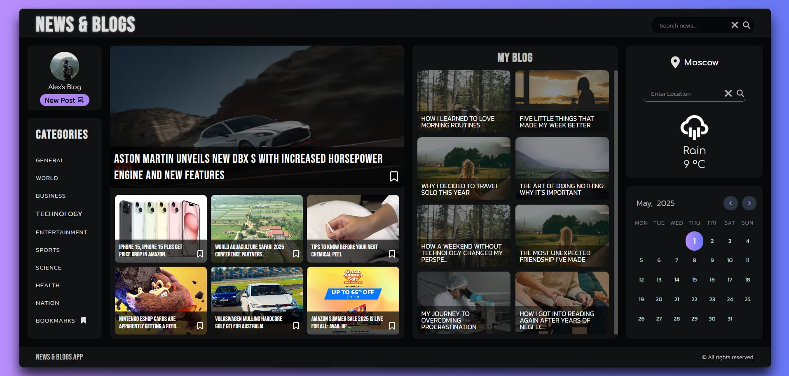
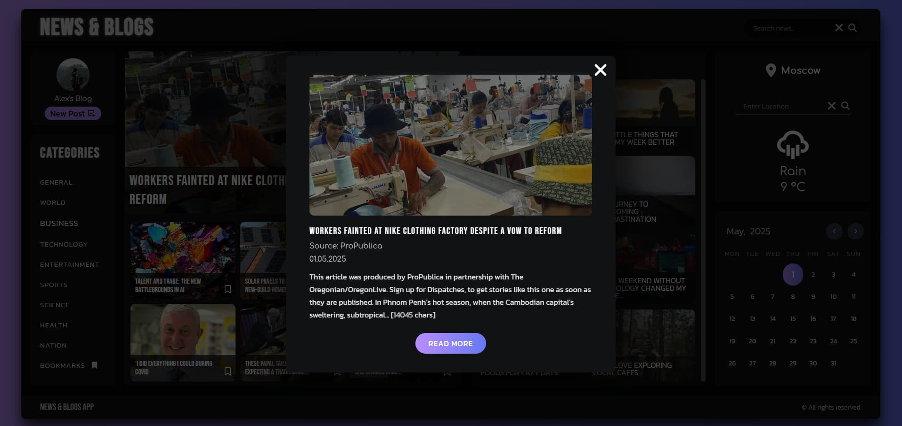
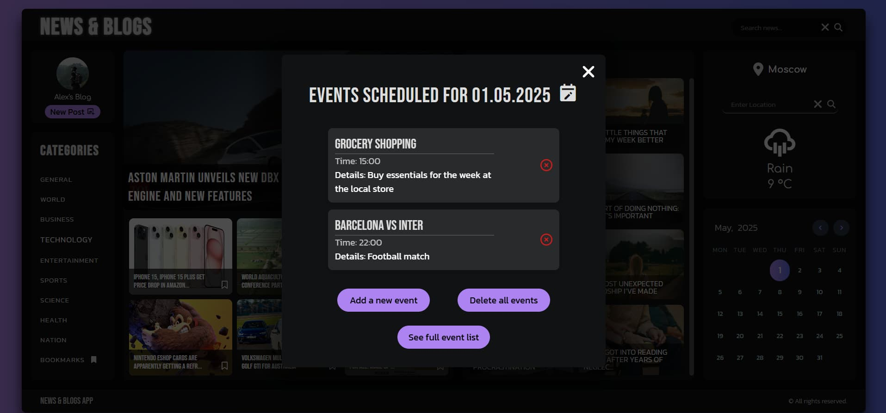
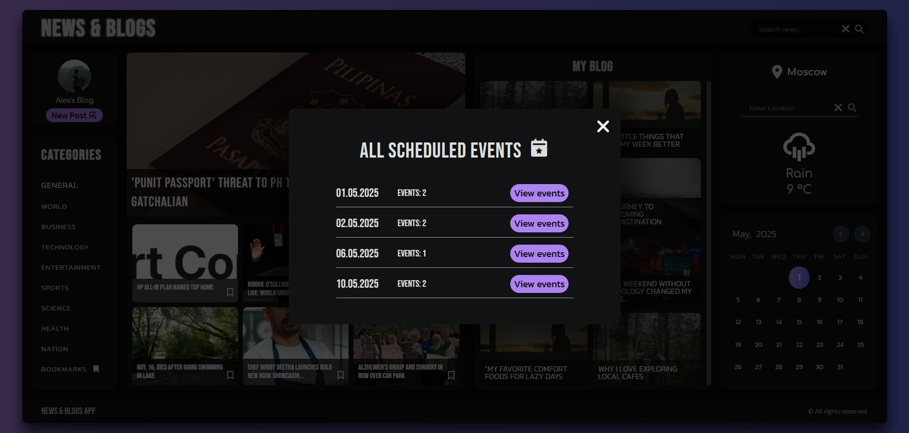
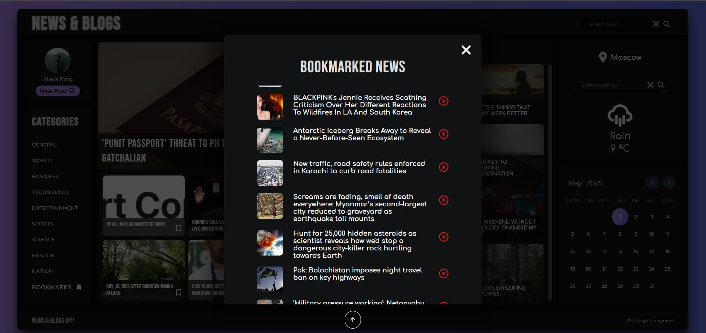
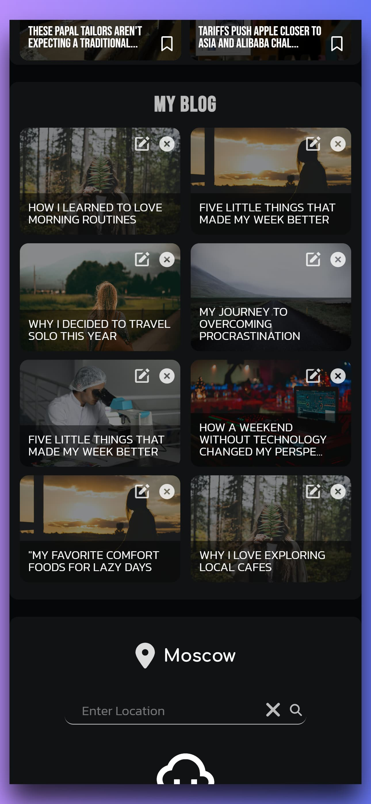
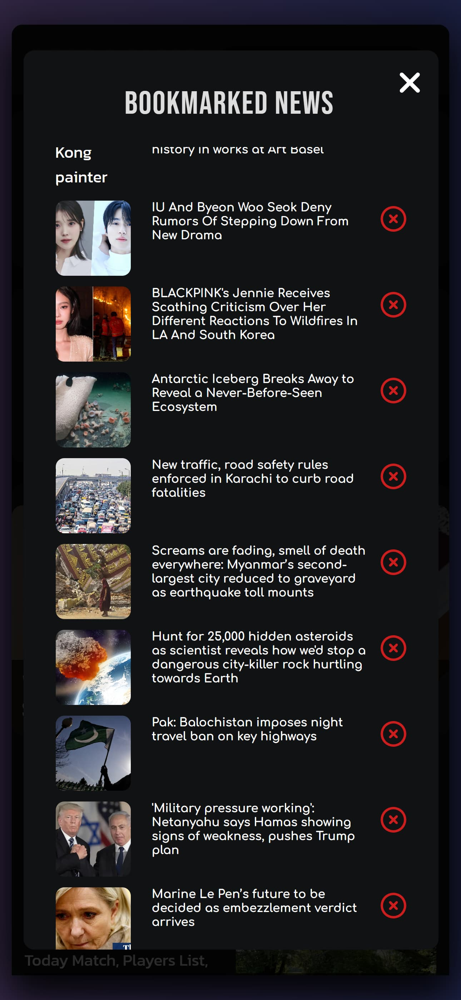
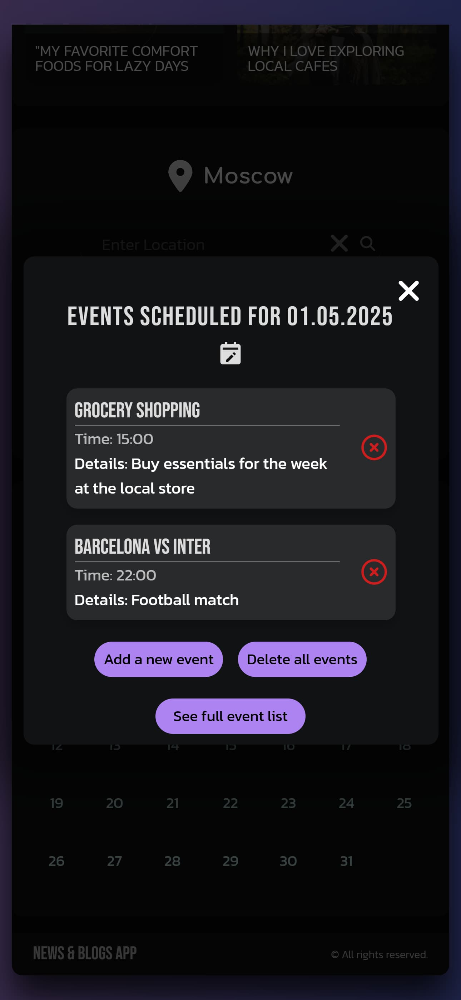
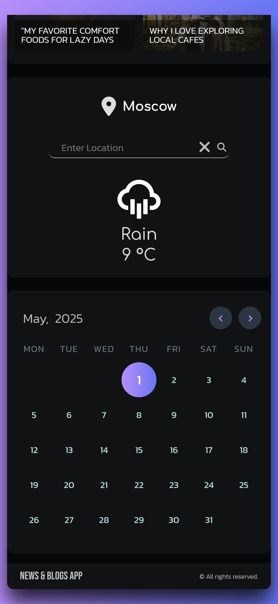

# 📰 News & Blogs App

A simple single-page application combining **news**, **weather**, **bookmarks**, **blog posts**, and a **calendar** — all stored in `localStorage`, no backend required.

---

## 🚀 Features

### 🌤️ Weather

- Search weather by city name
- Display current temperature and conditions (via GoWeather API)

### 🗞️ News

- Fetch latest news by category (technology, sports, health, etc.)
- Search news within selected category
- Save news to bookmarks
- View saved bookmarks in a modal window

### ✍️ Blogs

- Create your own blog posts with an image, title, and description
- Edit or delete posts
- All posts are stored locally

### 📅 Calendar

- Add events for any date
- Delete specific events
- View all scheduled events or for a selected date

### 💾 Data Storage

- All user data is stored in the browser using `localStorage`
- No backend or authentication needed

---

## 🛠️ Tech Stack

- **React** (with Hooks)
- **Tailwind CSS**
- **React Context API**
- **LocalStorage**
- **GoWeather API**
- **NewsAPI.org**

---

## 📸 Screenshots

### 💻 Desktop View







### 📱 Mobile View

| Hero Mobile                                      | Blog Mobile                                      | News Mobile                                      | Bookmarks Mobile                                      | Calendar Mobile                                      | Widgets Mobile                                      |
| ------------------------------------------------ | ------------------------------------------------ | ------------------------------------------------ | ----------------------------------------------------- | ---------------------------------------------------- | --------------------------------------------------- |
|  |  |  |  |  |  |

## 🚀 Getting Started

```bash
git clone https://github.com/alexcardx/news-blogs-app.git
cd news-blogs-app
npm install
npm run dev
```

## ⚙️ Environment Variables

Create a `.env` file in the root directory and add the following variables:

```env
VITE_API_KEY_NEWS = your_NewsAPI_api_key
VITE_API_KEY_WEATHER = your_GoWeather_api_key
```
